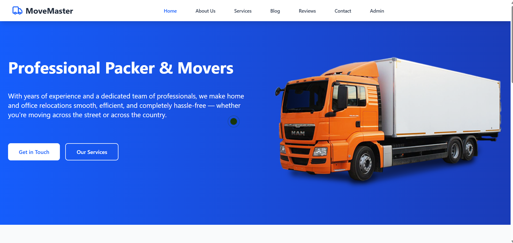
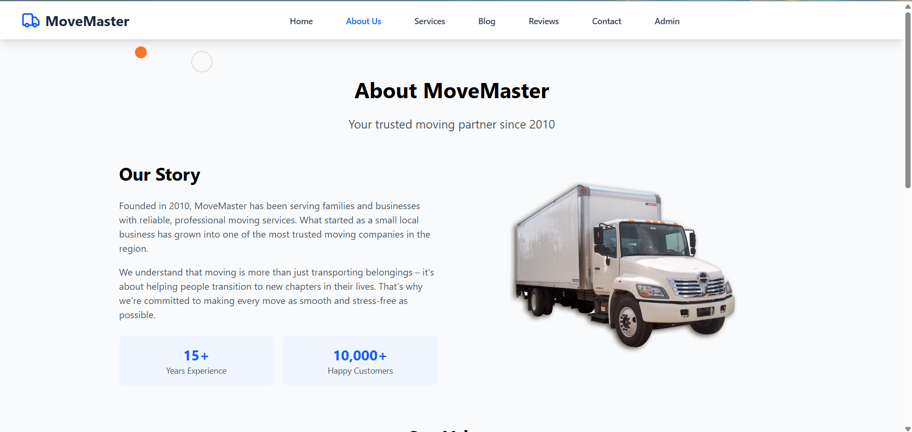
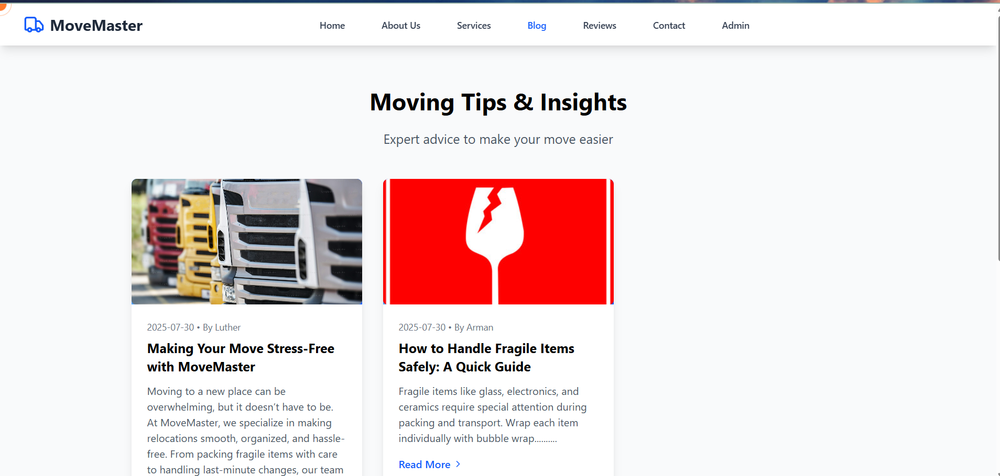
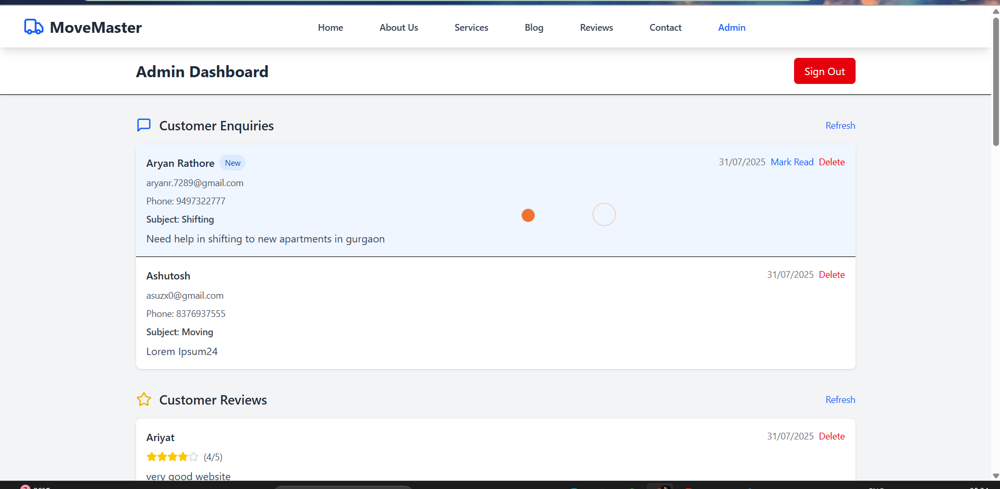
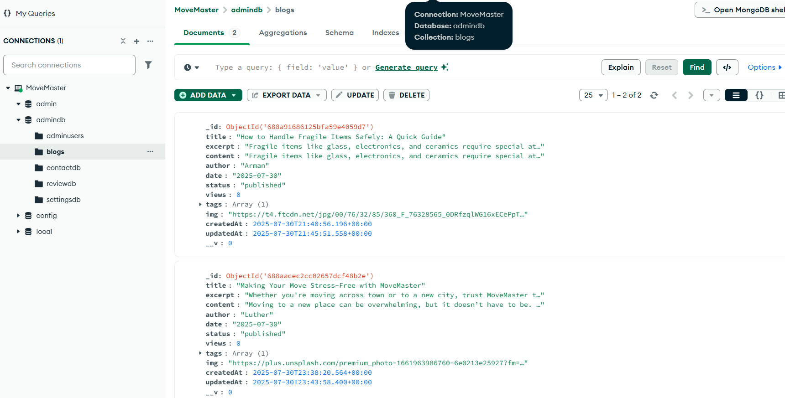
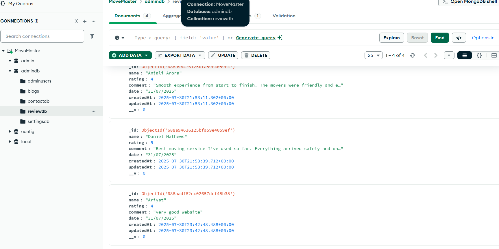

# MoveMaster

MoveMaster is a full-stack MERN (MongoDB, Express, React, Node.js) application designed for moving services, featuring a sleek and dynamic user experience with smooth animations and interactive notifications for a clean and engaging interface.

---

## ✨ Features

### 🔹 Public Features
- Fully responsive and mobile-friendly design for optimal viewing on all devices.
- Smooth and visually appealing animations for enhanced user engagement.
- Interactive notifications to provide instant feedback on user actions.
- Includes pages such as: Home, About Us, Services, Blog, Reviews, and Contact.
- Allows users to submit enquiries and reviews through dedicated forms.

### 🏠 WebPage Screenshots
  
  
---

### 🔐 Admin Panel

Accessible only via:
- **Email:** `admin@gmail.com`  
- **Password:** `Admin123`

Admin functionalities include:

#### ✅ Enquiries Management
- View all enquiries.
- **Mark as read/unread** (unread are visually highlighted).
- **Delete enquiries**.

#### ✅ Blog Management
- Add new blog posts with **image URLs**.
- View all blogs (only **published** blogs are shown on the public Blog page).
- **Update** existing blog posts.
- **Delete** blogs when needed.

#### ✅ Reviews Management
- View all submitted reviews (**newest at the top**).
- Delete inappropriate or outdated reviews.

#### ✅ Settings
- Update **contact email**.
- Update **business hours** displayed on the Contact page.

---

## 📦 Database Structure

The project uses **MongoDB** as the primary database. It consists of the following five collections:

| Collection Name | Purpose |
|------------------|---------|
| `contactdb`      | Stores all contact form enquiries submitted by users |
| `blogs`          | Contains blog posts including title, content, and meta info |
| `reviewdb`       | Stores user reviews with rating, message, and author details |
| `adminusers`      | Stores admin credentials for login and authentication |
| `settingsdb`     | Contains configurable app settings like contact email, working hours etc. |

---

### 🗃️ Screenshot of Collections in MongoDB Compass
 

## 🚀 Tech Stack

- **Frontend:** React.js, Tailwind CSS, Framer Motion, GSAP, Toastify
- **Backend:** Node.js, Express.js
- **Database:** MongoDB
- **Authentication:** Basic credential check (can be extended with JWT)

### 🎥 Demo Video

[Move Master](https://move-master-delta.vercel.app/)
